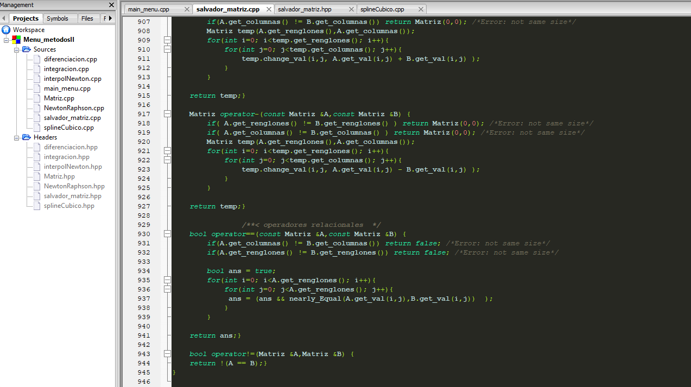
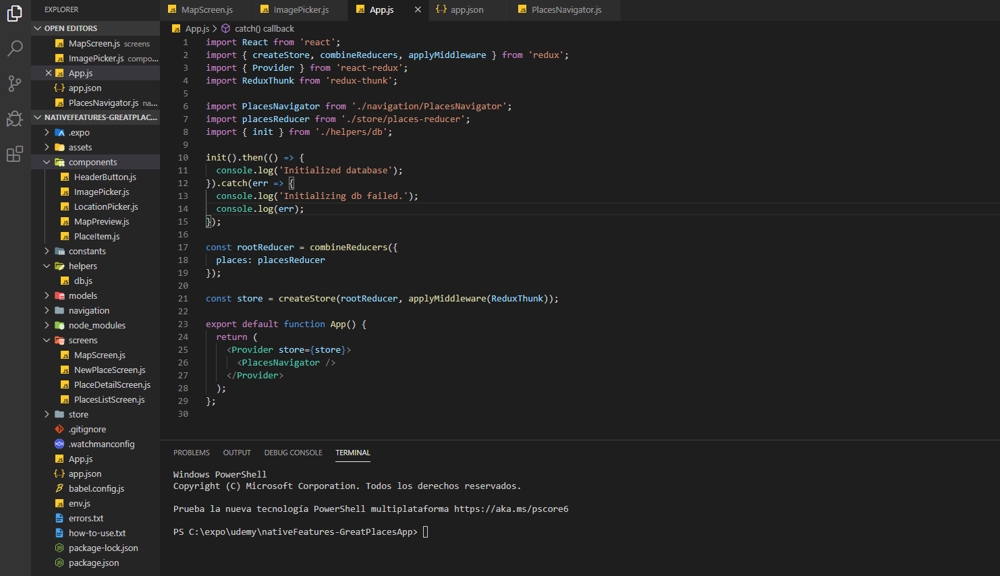
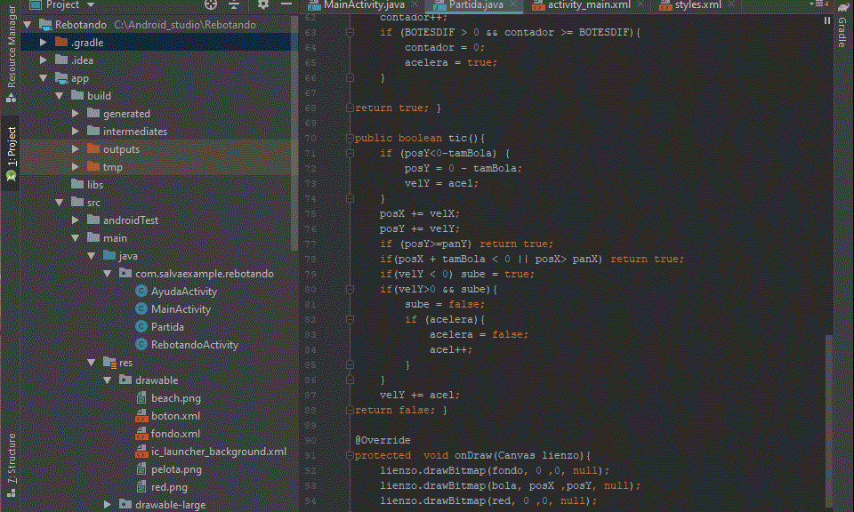
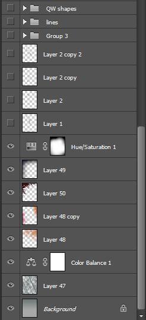
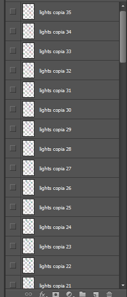
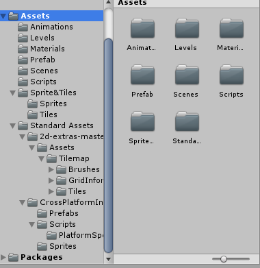

# Sesion 1: Administrando proyectos y recordando fundamentos!
---
## ¿Por qué  saber administrar proyectos?
A lo largo de la carrera se pueden encontrar con proyectos extensos que les encarguen sus profesores.
Por lo que sus proyectos (de una sola materia pueden lucir así):

 

Esto también  aplica para trabajos independientes en la vida profesional (y hobbies).
Lo cual puede ser muy común  en proyectos que requieren disciplinas, lenguajes y conocimientos
distintos:

Los ejemplos anteriores son solo unos cuantos elaborados individualmente.
*TL;DR: Organiza bien tus trabajos antes de que crezcan en horribles amalgamas*

## Recomendaciones:
1. Planea las etapas por las que pasara tu proyecto.
  * Todo proyecto empieza por algo, pero necesitara elementos.
  * Considera re-organizar los archivos en cada etapa.
2. Facilita la búsqueda.
  * Si un archivo contiene muchas funciones, considera separar en módulos  el archivo.
  * Agrupa elementos en común como funciones, imágenes, etc.
  * Debes ser muy claro y consistente con nombres y formatos.
3. Aísla  errores.
  * Separa tu programa y simplifica las entradas y salidas de datos.
  * Mantén un registro de *TODO*s y clasifica los errores en salida esperada, compilador, etc.
4. Busca inspiración!
  * Considera el enfoque del proyecto y busca similares.
  * Comparte y colabora en comunidad para retroalimentarse.

### Conocimientos de esta semana:
Es importante tener fresco el conocimiento sobre programación adquirido en el semestre pasado: 
[Temario de MAC (plan 2014)](http://www.mac.acatlan.unam.mx/media/temarios/1644/1112.pdf).
Si ya te sientes listo pasa a resolver el desafío de la semana para comprobar tus conocimientos.
