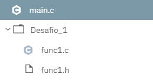

# Desafios de la primer semana
Solo la version yeyecoa cuenta para puntos extras, pero es opcional a diferencia del resto.
---
## 1.1 Proyecto.
1. Visita el siguiente enlace: https://repl.it/@SalvadorU/Proy1C.
2. Crea en **repl.it** (o un compilador en linea que les permita tener varios archivos en un proyecto) una carpeta similar a la mostrada en el enlace.
3. Incluye los archivos (sin main) en una carpeta llamada "Desafio_1".
4. Llama en el archivo principal (main) a la función definida en Desafío 1.
5. Crea un menú similar al de main.c con el que probaras cada Desafío que vayas elaborando.
6. Usa en la opción 1 un saludo personal (¡y tu imaginación!).  
Ejemplo de carpeta:  


## 1.2 Secuencias de control.
Elabora una función  que reciba un entero positivo y genere una pirámide con niveles
según el entero dado.Ejemplo:  
**Entrada**  
3  
**Salida**  
```javascript
  *
 ***
*****
```
**\*Version 2**: ahora agregale un tronco. Ejemplo:  
**Entrada**  
4  
**Salida**  
```javascript
   *
  ***
 *****
*******
   |
   |
   |
```
**\* \*Version 3**: Recibe otro entero que indique cuantos niveles tiene el árbol (ahora sera un pino). Ejemplo:  
**Entrada**  
3 2  
**Salida**  
```javascript
  *
 ***
*****
 ***
*****
  |
  |
```
**\+ \+ \+Yeyecoa**(*Simply Simple*): Ahora imprime el pino con hojas al azar (al menos 3). Ejemplo:  
**Entrada**  
3 2  
**Salida**  
```javascript
  +
 *^*
+^*+*
 *^+
^^++*
  |
  |
```
